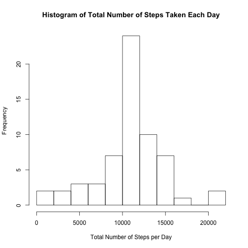

## Loading and preprocessing the data

```r
echo = TRUE
unzip("activity.zip")
## Read in data
activityDataRaw <- read.csv("activity.csv")
activityDataTidy <- activityDataRaw
##Normalize interval variable to a continous interval variable in minutes
activityDataTidy$interval <- (activityDataRaw$interval %/% 100 * 60) + (activityDataRaw$interval %% 100)
library(knitr)
library(dplyr)
```

## What was the mean total number of steps taken per day?

```r
dailySteps <- activityDataTidy %>%
  group_by(date) %>%
  summarize(sum(steps))

hist(dailySteps$sum, main = paste("Histogram of Total Number of Steps Taken Each Day"), xlab="Total Number of Steps per Day")
```

 

```r
meanSteps <- mean(dailySteps$sum, na.rm = TRUE)
medianSteps <- median(dailySteps$sum, na.rm = TRUE)
```

**Mean Daily Steps**

The **mean number of daily steps** is **1.0766189 &times; 10<sup>4</sup>.**

**Median Daily Steps**

The **median number of daily steps** is **10765.**

## What is the average daily activity pattern?

```r
meanStepsPerInterval <- activityDataTidy %>%
  group_by(interval) %>%
  summarize(mean(steps, na.rm = TRUE))

 plot(meanStepsPerInterval$interval, meanStepsPerInterval$mean, type="l", ylab="Mean Number of Steps", xlab="Time of day [min] - 5 min intervals", main="Mean Number of Steps per 5 Minute Interval throughout the Day")
```

 

```r
maxIndex <- which.max(meanStepsPerInterval$mean)
maxInterval <- meanStepsPerInterval$interval[maxIndex] 
```

The 5-minute interval, on average across all the days in the dataset, containing the maximum number of steps is: 515 - 520 min

## Inputing missing values

```r
missingObservations <- sum(is.na(activityDataTidy$steps))
```

In total there were 2304 missing values in the original dataset.  

These observations were substituted with the daily mean for those intervals, as calculated ignoring the missing values.

This substitution produces an adjusted set.  

```r
activityDataTidy2 <- activityDataTidy
naValues <- which(is.na(activityDataTidy2$steps))
naIntervals <- activityDataTidy2$interval[naValues]
naReplacements <- match(naIntervals, activityDataTidy2$interval)
activityDataTidy2$steps <- replace(activityDataTidy2$steps, naValues, meanStepsPerInterval[naReplacements])

dailySteps2 <- activityDataTidy2 %>%
  group_by(date) %>%
  summarize(sum(steps))
```

```
## Error in eval(expr, envir, enclos): invalid 'type' (list) of argument
```

```r
hist(dailySteps2$sum, main = paste("Histogram of Total Number of Steps Taken Each Day"), xlab="Total Number of Steps per Day")
```

 

```r
meanSteps2 <- mean(dailySteps2$sum, na.rm = TRUE)
medianSteps2 <- median(dailySteps2$sum, na.rm = TRUE)
```

In consideration of the new data set, the following data is returned.

**Mean Daily Steps**

The **mean number of daily steps** is **1.0367441 &times; 10<sup>4</sup>.**

**Median Daily Steps**

The **median number of daily steps** is **1.06825 &times; 10<sup>4</sup>.**

Making adjustments for the missing values has dropped both the median and mean for of the set.

## Are there differences in activity patterns between weekdays and weekends?

